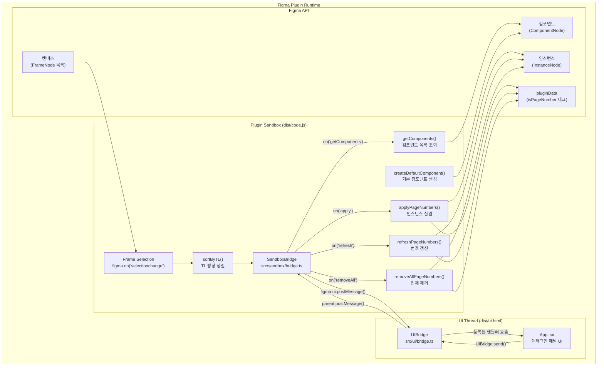
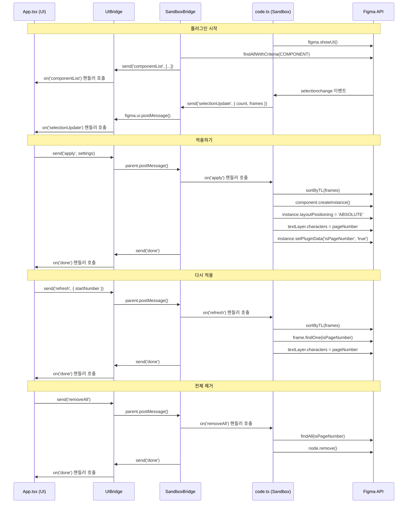
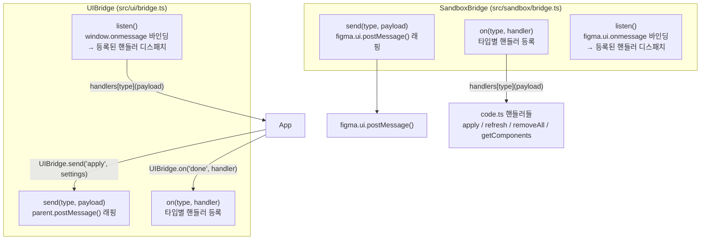
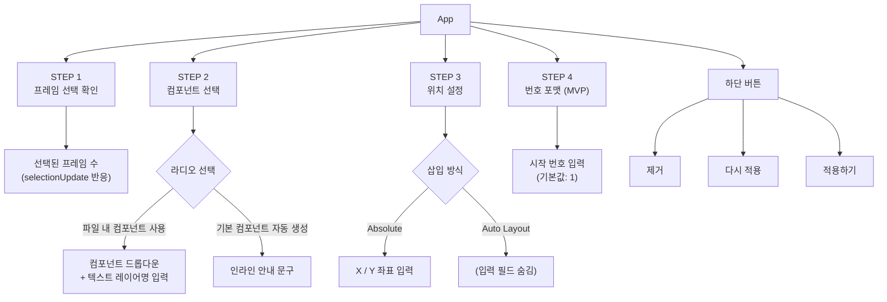
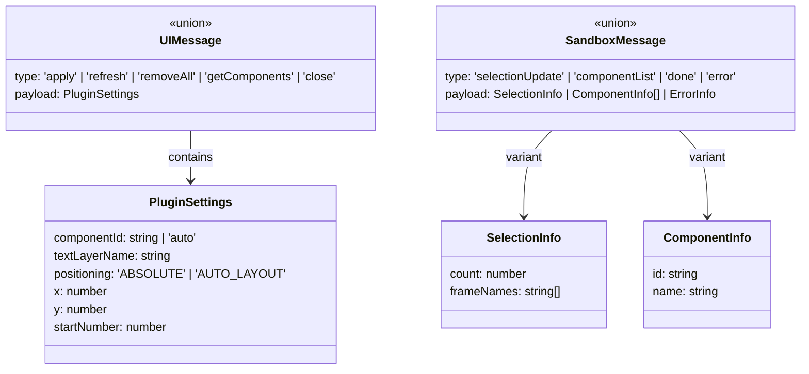

# Page Stamp — Architecture

## 전체 구조

---

## 메시지 흐름

---

## Bridge 구조 (방식 B — 타입별 핸들러 등록)

### 파일 위치

| 파일 | 역할 |
| --- | --- |
| `src/ui/bridge.ts` | UIBridge 모듈 — UI 스레드에서 import |
| `src/sandbox/bridge.ts` | SandboxBridge 모듈 — Plugin Sandbox에서 import |
| `src/types.ts` | 메시지 타입 맵 (UIMessageMap, SandboxMessageMap) |

---

## UI 컴포넌트 트리

---

## 데이터 모델

